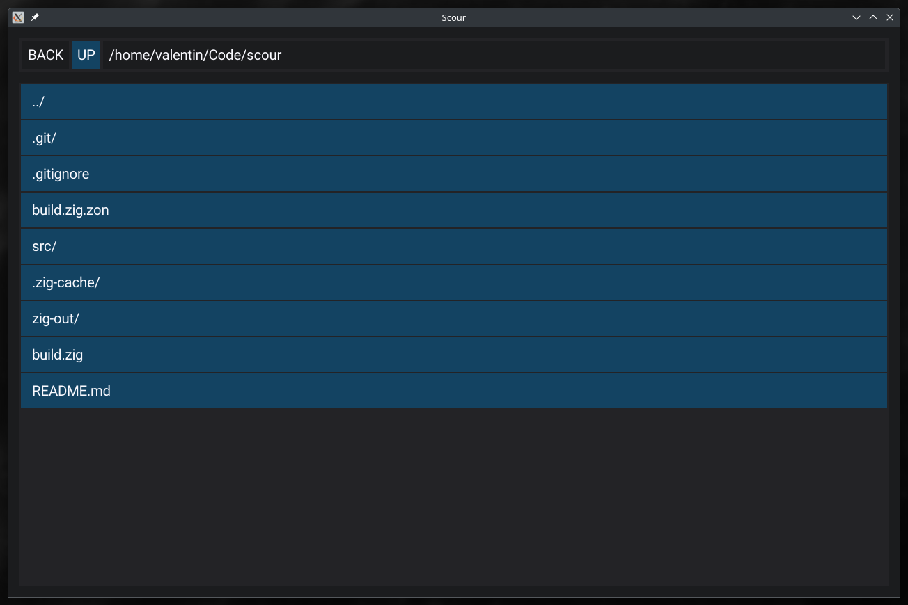

# Scour - Awful file explorer

# Goal
This is a learning oportunity for me.
What I will learn :
- Zig
    - FS/IO
    - Closures
    - Interfaces
    - Async
    - ...
- RayLib ([Not-Nik/raylib-zig](https://github.com/Not-Nik/raylib-zig))
    - Drawing stuff.
- Clay ([johan0A/clay-zig-bindings](https://github.com/johan0A/clay-zig-bindings))
    - Layout stuff.

I will also learn how OSses and DEs do some things, ex. opening a file with the default app.

# Features :
- [x] Listing files
- [x] Moving directories
- [x] Opening files
- [x] Path bar
- [x] Navigation buttons (Go up, back)
- [ ] Context menu
    - [ ] Copy
    - [ ] Paste
    - [ ] Delete
    - [ ] Rename
    - [ ] New folder
    - [ ] New file
    - [ ] Open terminal
- [ ] Drag and drop
    - [ ] Move file into dir
    - [ ] Move file into other app
    - [ ] Move file from other app
- [ ] Fuzzy find
